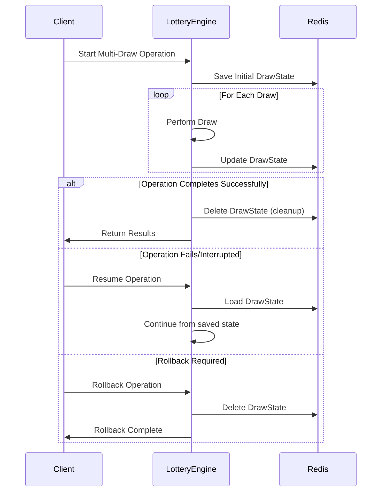

# Design Document

## Overview

This design implements Redis-based state persistence for multi-draw lottery operations. The implementation will replace the current placeholder methods (`SaveDrawState`, `LoadDrawState`, `RollbackMultiDraw`) with fully functional Redis-backed persistence that enables operation recovery and rollback capabilities.

The design leverages the existing Redis client (`github.com/go-redis/redis/v8`) already used by the lottery engine for distributed locking, ensuring consistency in Redis operations and connection management.

## Architecture

### State Persistence Flow



### Redis Key Strategy

The system will use a hierarchical key naming convention:
- **Pattern**: `lottery:state:{lockKey}:{operation_id}`
- **Example**: `lottery:state:user_123_daily:multi_draw_20241217_143022`
- **TTL**: 1 hour (3600 seconds) to prevent stale data accumulation

## Components and Interfaces

### 1. State Serialization Component

**Purpose**: Handle JSON serialization/deserialization of DrawState objects.

**Key Functions**:
- `serializeDrawState(drawState *DrawState) ([]byte, error)`
- `deserializeDrawState(data []byte) (*DrawState, error)`

**Implementation Details**:
- Uses Go's standard `encoding/json` package
- Handles all DrawState fields including nested Prize objects
- Validates data integrity during deserialization

### 2. Redis Key Management Component

**Purpose**: Generate and manage Redis keys for state persistence.

**Key Functions**:
- `generateStateKey(lockKey string) string`
- `parseStateKey(key string) (lockKey string, err error)`

**Implementation Details**:
- Generates unique operation IDs using timestamp and random components
- Ensures key uniqueness across concurrent operations
- Provides key validation and parsing utilities

### 3. State Persistence Manager

**Purpose**: Core component that handles all Redis operations for state management.

**Key Functions**:
- `saveState(ctx context.Context, key string, state *DrawState, ttl time.Duration) error`
- `loadState(ctx context.Context, key string) (*DrawState, error)`
- `deleteState(ctx context.Context, key string) error`

**Implementation Details**:
- Wraps Redis client operations with proper error handling
- Implements retry logic for transient Redis failures
- Provides consistent logging across all operations

## Data Models

### Enhanced DrawState Structure

The existing `DrawState` struct will be used as-is, with JSON tags already properly defined:

```go
type DrawState struct {
    LockKey        string      `json:"lock_key"`
    TotalCount     int         `json:"total_count"`
    CompletedCount int         `json:"completed_count"`
    Results        []int       `json:"results,omitempty"`
    PrizeResults   []*Prize    `json:"prize_results,omitempty"`
    Errors         []DrawError `json:"errors,omitempty"`
    StartTime      int64       `json:"start_time"`
    LastUpdateTime int64       `json:"last_update_time"`
}
```

### Redis Storage Format

**Key**: `lottery:state:{lockKey}:{operation_id}`
**Value**: JSON-serialized DrawState
**TTL**: 3600 seconds (1 hour)

**Example JSON**:
```json
{
  "lock_key": "user_123_daily",
  "total_count": 10,
  "completed_count": 7,
  "results": [42, 17, 89, 3, 56, 23, 91],
  "start_time": 1703123456,
  "last_update_time": 1703123789
}
```

## Error Handling

### Error Classification

1. **Validation Errors**: `ErrDrawStateCorrupted`
   - Invalid DrawState structure
   - Failed validation checks
   - Corrupted JSON data

2. **Redis Connection Errors**: `ErrRedisConnectionFailed`
   - Network connectivity issues
   - Redis server unavailable
   - Authentication failures

3. **Serialization Errors**: `ErrInvalidParameters`
   - JSON marshaling/unmarshaling failures
   - Invalid data types
   - Encoding issues

### Error Recovery Strategy

- **Transient Redis Errors**: Retry with exponential backoff (up to 3 attempts)
- **Serialization Errors**: Immediate failure with detailed logging
- **Validation Errors**: Immediate failure with state corruption indication
- **Missing State**: Return nil (not an error condition)

## Testing Strategy

### Unit Tests

1. **Serialization Tests**
   - Test JSON marshaling/unmarshaling of DrawState
   - Test handling of nil/empty fields
   - Test error conditions (invalid JSON, missing fields)

2. **Redis Operations Tests**
   - Test save/load/delete operations
   - Test TTL behavior
   - Test error handling (connection failures, timeouts)
   - Test concurrent access scenarios

3. **Integration Tests**
   - Test complete save/load/rollback workflows
   - Test state persistence during actual multi-draw operations
   - Test recovery scenarios with real Redis instance

### Test Data Strategy

- Use table-driven tests for various DrawState configurations
- Mock Redis client for unit tests using `go-redis/redismock`
- Use Redis test containers for integration tests
- Test edge cases: empty results, large datasets, expired keys

### Performance Tests

- Benchmark serialization/deserialization performance
- Test Redis operation latency under load
- Validate memory usage with large DrawState objects
- Test TTL cleanup behavior

## Implementation Considerations

### Concurrency Safety

- All Redis operations use context for timeout control
- State updates are atomic (single Redis SET operation)
- No additional locking required (leverages existing distributed locks)

### Memory Management

- JSON serialization creates temporary byte arrays
- Large DrawState objects (1000+ results) may impact memory
- Consider streaming serialization for very large states

### Monitoring and Observability

- Log all state persistence operations at DEBUG level
- Log errors at ERROR level with full context
- Include operation timing in debug logs
- Track state size metrics for monitoring

### Backward Compatibility

- New implementation maintains existing method signatures
- Existing error types and behaviors preserved
- No breaking changes to public API
- Graceful handling of missing or corrupted legacy state